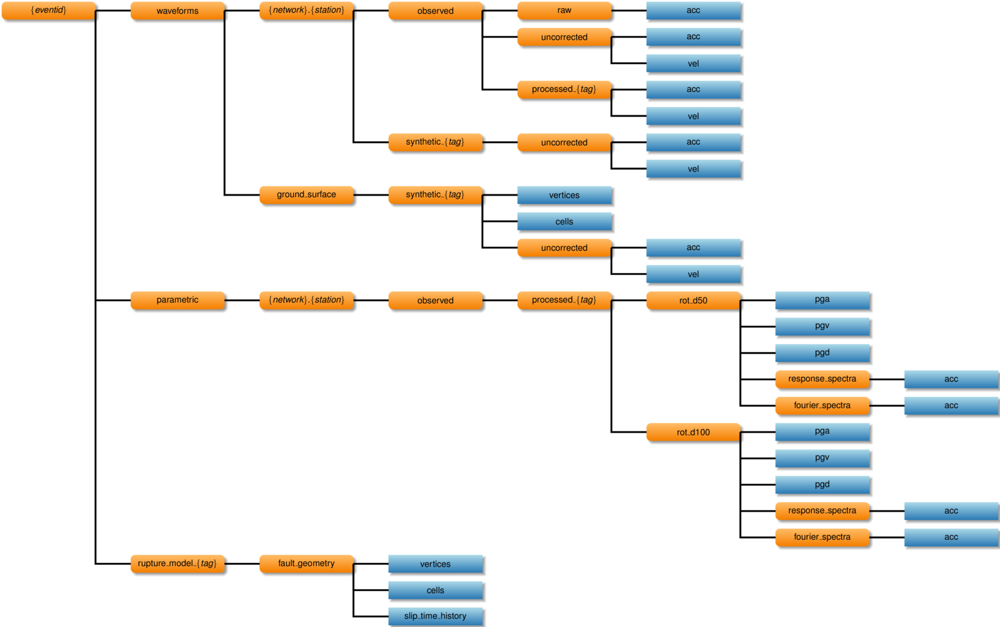

# Storage of Waveforms and Metadata

## Metadata Database

### event (subset of QuakeML)

Metadata associated with the earthquake.

  * event_id
  * description
  * comment
  * origins (array of event_origin)
  * preferred_origin
  * moment_tensors (array of event_moment_tensor)
  * preferred_moment_tensor
  * magnitudes (array of event_magnitude)
  * preferred_magnitude

#### event_origin

#### event_moment_tensor

#### event_magnitude

### station (subset of Station XML)

Metadata associated with seismic station.

  * network_code
  * station_code
  * start_date
  * end_date
  * longitude_deg
  * latitude_deg
  * elevation_m
  * site_name
  * channels (array of station_channel)
  * vs30_mps
  * z1.0_m
  * z2.5_m

#### station_channel

  * channel_code
  * location_code
  * start_date
  * end_date
  * longitude
  * latitude
  * elevation_m
  * depth_m
  * azimuth_deg
  * dip_deg
  * sample_rate_hz
  * sensor_description

### record

Metadata associated with the recording of a specific earthquake at a
specific seismic station.

  * event
  * station
  * channels (array of station_channel)
  * raw_available (True if raw data available)
  * uncorrected_available (True if uncorrected data available)
  * processed (array of record_processing)

#### record_processing

Metadata associated with processing of records. This includes
computing additional metadata, such as epicentral distance and rupture
distance, for a given fault model and hypocenter.

  * tag
  * date_processed
  * description
  * epicentral_distance_km
  * hypocentral_distance_km
  * mean_rupture_distance_km

### rupture_model

Metadata associated with a rupture model.

  * event
  * version
  * author
  * date
  * depth_top_of_rupture_km
  * tag

### synthetic

Metadata associated with a ground-motion simulation.

  * author
  * date
  * version
  * tag
  * gmsim_software (software)

### software

Metadata associated with software. This could be software used in
processing records or simulating ground-motions.

  * author
  * version
  * description
  * url
  * DOI

## Waveform HDF5 Layout

The scientific data, waveforms and parametric derived from the
waveforms such as response spectra, are stored in an HDF5 file. The
Hiearchical organization of datasets mimics the filesystem while
keeping datasets in a single file to faciliate
distribution. Additionally, the datasets can seamleslly be compressed
and uncompressed and values converted between little and big endian.

<table class="image">
<caption align="bottom">Hierarchy of waveform and related data in the
HDF5 file. Values in braces are variables. For brevity displacement
waveform datasets are not shown.</caption>
<tr><td></td></tr> </table>

